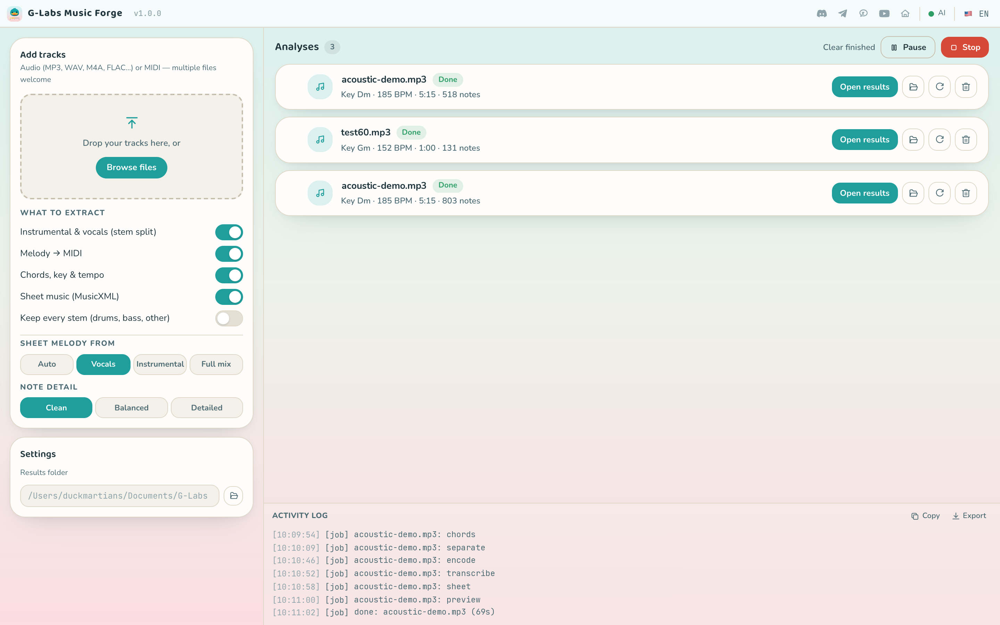
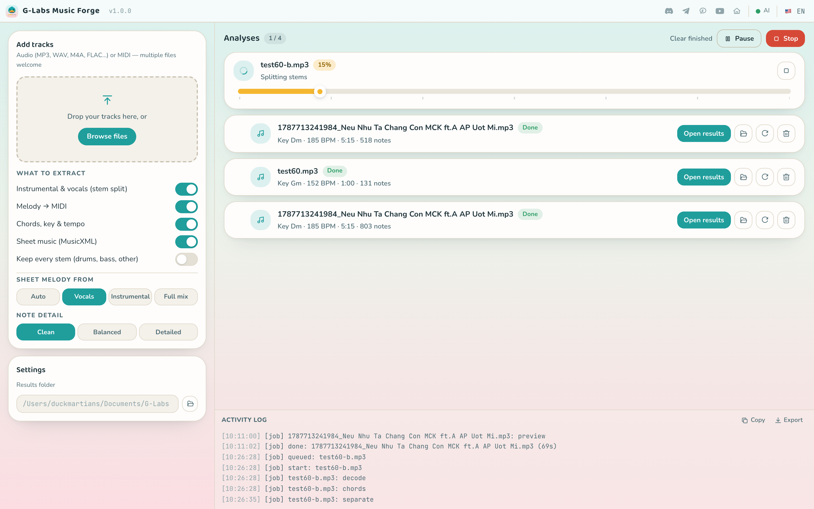
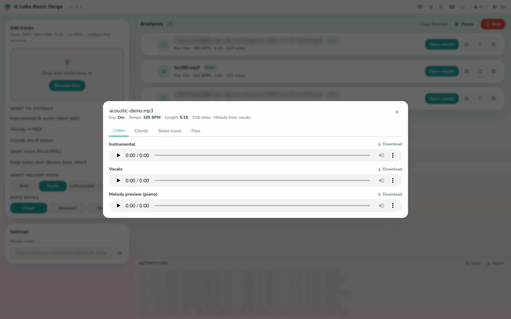
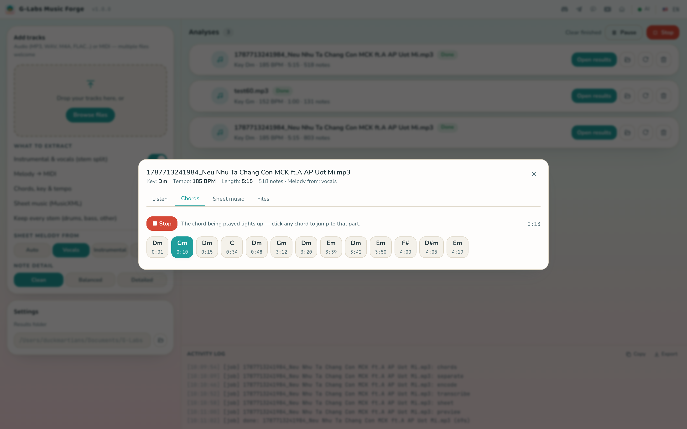
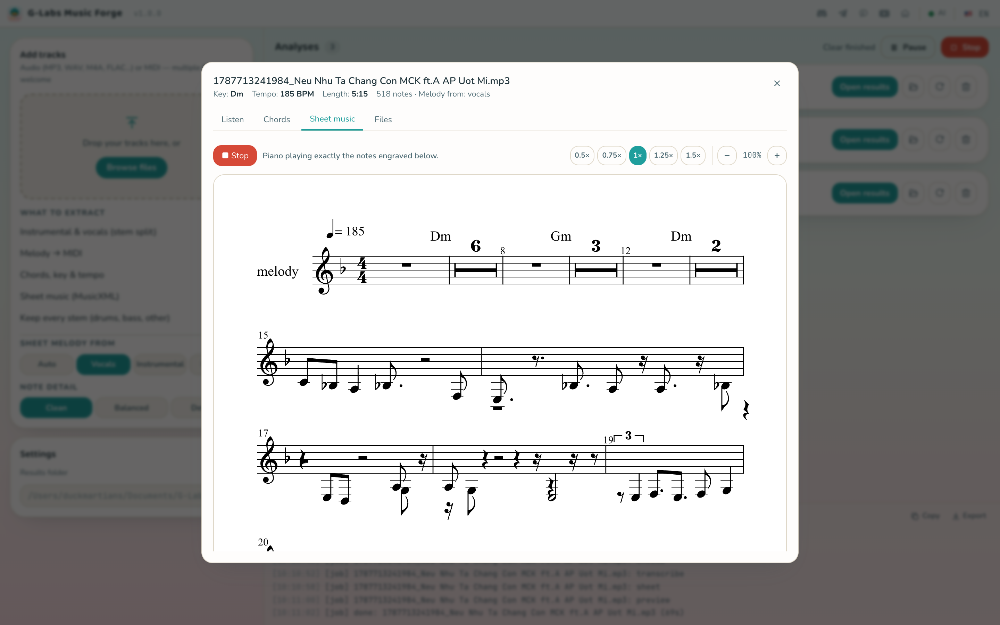
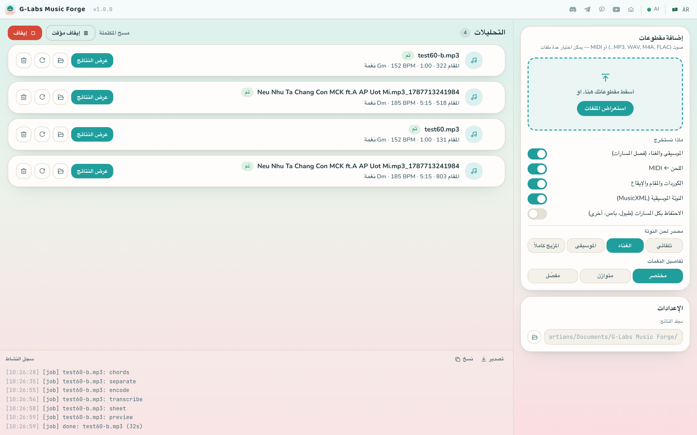

<h1 align="center">G-Labs Music Forge</h1>

<p align="center"><b>A free desktop app that turns a song into an instrumental, stems, melody MIDI, chords/key/tempo and playable sheet music, all processed offline on your own computer.</b></p>

<p align="center">
  <b>English</b> ·
  <a href="README.vi.md">Tiếng Việt</a>
</p>

<p align="center">
  <a href="https://github.com/duckmartians/G-Labs-Music-Forge/releases/latest"></a>&nbsp;
  <a href="https://github.com/duckmartians/G-Labs-Music-Forge/releases/latest"></a>
</p>

---

## Install

### Step 1 — Pick the right build for your machine

Download the latest build from **[Releases](https://github.com/duckmartians/G-Labs-Music-Forge/releases/latest)**, then choose the file that matches your machine:

| Your machine | Download | Notes |
|---|---|---|
| 🪟 **Windows 10/11 (64-bit)** | `GLabsMusicForge-<version>-setup.exe` | Installer. The engine runs on the CPU, no graphics card needed |
| 🍎 **Mac with Apple chip (M1/M2/M3/M4)** | `GLabsMusicForge-<version>-arm64.dmg` | Stem splitting is GPU-accelerated |

> There is **no Intel Mac build** yet. The arm64 build will not open on an Intel Mac.

### Step 2 — Install

<details open>
<summary><b>🪟 On Windows</b></summary>

1. Open the downloaded **`GLabsMusicForge-<version>-setup.exe`**.
2. If **"Windows protected your PC"** (SmartScreen) appears: click **More info** → **Run anyway**. *(The app isn't code-signed with a Microsoft certificate, so it's flagged — it isn't a virus.)*
3. Follow the installer. You can change the install folder if you want.
4. Launch it from the **Start Menu** or the **Desktop** shortcut.

</details>

<details open>
<summary><b>🍎 On macOS</b></summary>

1. Open the downloaded **`.dmg`**, then **drag G-Labs Music Forge into the Applications folder**.
2. Go to **Applications**, **right-click** (or Control-click) **G-Labs Music Forge** → **Open** → click **Open** again in the dialog. *(The app isn't signed by Apple, so you must open it this way the **first time**; afterwards it opens normally.)*
3. If macOS says the app is **"damaged / can't be opened"**, or there's no Open button, open **Terminal** and paste:
   ```bash
   xattr -dr com.apple.quarantine "/Applications/G-Labs Music Forge.app"
   ```
   Then open the app again.

</details>

### Step 3 — No account needed

Music Forge is **free**: no plans, no license key, no sign-in. The AI models (Demucs, basic-pitch) and FFmpeg ship inside the installer, so there is no Python or FFmpeg to install and analysis works without an internet connection.

The app **updates itself**: on launch it checks GitHub Releases, and the version badge lets you download the new version from inside the app. On Windows the installer runs and relaunches the app; on macOS the app closes and opens the new `.dmg` — drag the app into Applications to replace the old one, then reopen it.

---

## First run

1. **Open the app.** The engine dot in the title bar turns green when the analysis engine is ready.
2. **Add tracks** — drag and drop or **Browse files**: audio (MP3, WAV, M4A, AAC, FLAC, OGG, OPUS, WEBM, AIFF, WMA) or MIDI (`.mid`, `.midi`). You can add many at once.
3. **Pick what to extract** — Instrumental & vocals, Melody → MIDI, Chords, key & tempo, Sheet music; choose the sheet source and note detail.
4. Press **Start queue** and watch each track's progress in **Analyses**.
5. When a track is **Done**, click **Open results** to listen, play along with the chords, play the sheet, or open the folder and drag the files into your DAW.

---

## Features



- **Stem split & instrumental** — Demucs separates vocals / drums / bass / other. The instrumental is made by subtracting the vocals from the original, so the backing track keeps full quality. Turn on **Keep every stem** to also get drums, bass and other.
- **Melody → MIDI** — basic-pitch transcribes the sung melody into a single lead line (`melody.mid`). A vocal-energy gate stops separation bleed from creating phantom notes where nobody sings.
- **Sheet source & note detail** — transcribe the sheet from **Auto · Vocals · Instrumental · Full mix**, with a **Clean / Balanced / Detailed** note-detail setting that trades ornaments for readability.
- **Chords, key & tempo** — a beat-aligned chord progression with a play-along view: the instrumental plays underneath, the sounding chord lights up, click any chord to jump there.
- **Sheet music that plays** — MusicXML engraved in the app; a piano performs exactly the engraved notes while the current note lights up and the page follows. Playback speed 0.5–1.5× (pitch preserved) and zoom.
- **Multi-track queue** — add many files, then **Start queue / Pause** (the current track finishes) **/ Stop** (cancels it).
- **Re-run with current options** — tick more extractions and press ↻ on a finished track, or drag a box over several rows (Shift adds, Alt removes) and **Re-run selected**.
- **Bring your own MIDI** — drop in a `.mid` file and the app builds the sheet and piano preview straight from it, no stem split needed.
- **DAW-ready results** — one folder per song with MP3 instrumental/stems, `melody.mid`, quantized `sheet.mid`, `sheet.musicxml`, `chords.json` and a piano preview MP3.
- **Local & private** — everything runs on your computer; nothing is uploaded. The network is only used to check for updates.
- **6 languages** — English, Tiếng Việt, 简体中文, Español, العربية (right-to-left), Русский.

---

## Pages

### 🎛 Main window — add tracks &amp; the queue



Add tracks on the left, set **What to extract**, and the tracks land in **Analyses**. Each row shows its stage (decoding, splitting stems, transcribing melody, engraving the sheet…) and progress. From a row you can open results, open its folder, re-run it with the current options, cancel or remove it. The **Activity log** can be copied or exported, and **Settings** holds the results folder.

### 🎧 Listen



Play the instrumental, vocals and (if kept) drums, bass and other instruments, with a download button for each file and the melody piano preview.

### 🎸 Chords



Key, tempo and the beat-aligned chord progression. Press **Play along**: the instrumental plays, the chord being played lights up, and clicking any chord jumps to that part of the song.

### 🎼 Sheet music



The engraved MusicXML score. **Play this sheet** has a piano perform exactly what's written, with speed (0.5×–1.5×) and zoom controls. The transcription is a sketch by design — treat it as a draft to refine, not a finished score.

### 📁 Files

Every output file for the track (MP3s, `melody.mid`, `sheet.mid`, `sheet.musicxml`, `chords.json`) with **Download** and **Show in folder**.

### 🌐 Languages



Switch the interface language at any time; Arabic uses a full right-to-left layout.

---

## How it works

```
song.mp3 ──► decode ──► chords/key/tempo (chroma + Viterbi)
                 │
                 ├──► Demucs stem split ──► instrumental = original − vocals
                 │
                 └──► basic-pitch (ONNX) ──► melody.mid ──► quantize ──► sheet.musicxml
                                                     └──► piano preview (renders the QUANTIZED
                                                          score, so what you hear is what's engraved)
```

Rap sections transcribe dense by nature; the **Clean** note detail works best there.

---

## Where your data lives

| What | macOS | Windows |
|---|---|---|
| Results (one `<song>_<time>` folder per track) | `~/Documents/G-Labs Music Forge` | `%USERPROFILE%\Documents\G-Labs Music Forge` |
| Settings (`settings.json`) | `~/Library/Application Support/G-Labs Music Forge` | `%APPDATA%\G-Labs Music Forge` |

You can change the results folder in **Settings → Results folder**.

---

## Troubleshooting

**"Analysis engine not found — reinstall the app"** — the bundled engine is missing or broken. Download the latest build from [Releases](https://github.com/duckmartians/G-Labs-Music-Forge/releases/latest) and reinstall.

**The sheet has too many notes / looks messy** — pick **Clean** note detail, or try another sheet source (e.g. **Vocals**), then press ↻ to re-run the track.

**Stem splitting is slow on Windows** — on Windows the engine runs on the CPU; only Apple Silicon Macs get GPU acceleration.

**Windows blocks it with "Windows protected your PC"** — click **More info → Run anyway**. The app isn't code-signed, so it's flagged — it isn't a virus.

**macOS says the app is damaged / can't be opened** — it isn't signed by Apple. Right-click → **Open** the first time, or run `xattr -dr com.apple.quarantine "/Applications/G-Labs Music Forge.app"`.

**An update didn't install** — download the latest build manually from [Releases](https://github.com/duckmartians/G-Labs-Music-Forge/releases/latest).

> You are responsible for the rights to any song you process and for how you use the results.
